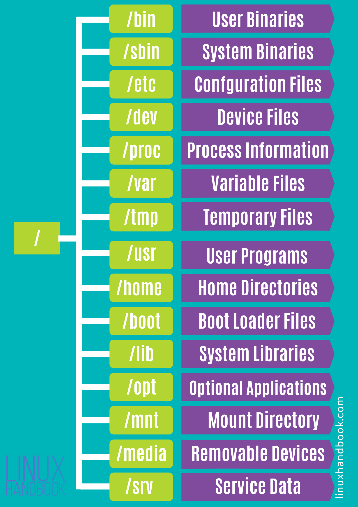

# Linux and Bash #
pg. no. 15 - book: Linux with OS concepts - 20240418

## The Command Line Interface ##
- The CLI is a part of the shell. 
- The shell itself contains the CLI, an interpreter and an environment of previously defined entities like functions and variables. 
  
            What is an interpreter? 
            : It is a program that accepts user inputs, interprets the commands entered and executes it. 
            
            Interpreted program vs Compiled program
            : 
                
                1. The main disadvantage of using an interpreted programming language is that the translation task can be time consuming. By writing the program all at once, the time to compile (translate) the program is paid for by the programmer all in advance of the user using the program. Now, all the user has to do is run the executable program; there is no translation time for the user. If the program is interpreted instead, then the translation task occurs at run-time every time the user wants to run the program. This makes the interpreted approach far less efficient. 
                2. The interpreter runs in an environment consisting of previously defined terms that have been entered by the user during the current session. These definitions include instructions, command shortcuts (called aliases), and values stored in variables. Thus, as commands are entered, the user can call upon previous items still available in the interpreter’s environment. This simplifies the user’s interactions with the operating system.

            - The combination of an interpreter, an environment and and the command line makes up the shell. 
            - The shell is an interface between the user and the core components of the operating system, known as the kernel. 
            - User can define the components of a shell in the command line and in separate files known as scripts. 

- POSIX: portable operating system interface. Defines a set of standards that OS developers strive to conform to. POSIX defines an application programming interface (API), so that programmers know what functions, data structures, and variables they should define or utilize to implement the code they are developing for the operating system. POSIX API has been used to develop Linux Standard Base (LSB). 
  - LSB: Among many other things, it defines the top level directory structure of linux and the location of significant linux files such as libraries, executables, and configuration files, a base set of linux commands and utilities to be implemented, and implementations for such programs as gcc, the C compiler. 

## Types of users in Linux ##
SuperUsers and normal users + software accounts. 
- Superusers in Linux are called root users. The root user has access to all system commands and so can access all the system resources through those commands. 

## Filesystem Hierarchy Standard ##
FHS defines the directory structure and the content/purpose of each directories in the linux distributions. 

Main directories in the root directory: 
- bin: Binary Files - contains executable files of many basic shell commands. Most programs are in binary format and are accessible to all users in the linux system. 
- dev: Device files - These are virtual files not physically on the disk. 
  - /dev/null: can be sent to destroy any file or string.
  - /dev/zero: contains an infinite sequence of 0.
  - /dev/random: contains an infinite sequence of random values. 
- etc: files - This contains the core configuration files of the system, used primarily by administrator and services, such as the password file and networking files. This folder is where you will find the required files to make changes in system configuration.  
- usr: User binaries and program data - All executable files, libraries, and most system programs exist in /usr. For this reason most of the files contained therein are readonly for the normal user. 
  - bin: /usr/bin: contains basic user commands.
  - sbin: /usr/sbin: contains additional commands for the administrator. 
  - man
  - lib: /usr/lib: contains system libraries. 
  - local
  - share: /usr/share: contains documentation common to all libraries. 
- home: User personal data: It contains user specific data and user specific configuration files. To create a user in a linux system, it is a general practice to create a home directory for the user. File permissions restrict each user to their own homw directories. 
- lib: Shared Libraries - basically codes that can be used by the executable binaries. /lib holds the libraries needed by /bin and /sbin directories. 
- sbin: System binaries - These contain the binaries that can be run only by a sudo user or the root user. 's' in 'sbin' can be thought of as 'super' or 'sudo'.
- tmp: Temporary files - This directory holds temporary files. Many applications use this directory to store temporary files. Contents of /tmp directories are deleted when the system restarts.
- var: Variable data files: This is where programmers store runtime information like system logging, user tracking, caches, and other files that system programs create and manage. The files stored here are not cleaned automatically and hence this is a good place for system adminstrators to look for information about system behavior. 
  - log
  - lock
  - tmp
- boot: Boot files: Thsi contains files of the kernel and the boot image, in addition to LILO and Grub. It is advisable that the directory resides in a partition at the beginning of the disc. 
- proc: Process and kernel files: Contains information about currently running processes and kernel parameters. The content of the proc directory is used by a number of tools to get runtime system information. 
  - For processor information, check /proc/cpuinfo file
  - To check memory usage, check /proc/meminfo file 
- opt: optional software - For installing/storing the files of third-party applications that are not available from the distribution's repository. The normal practice is to keep the software code in opt and link the binary file in /bin directory so that all users can use it. 
- media: Mount point for removable media: When any removable media is connected, a directory is automatically created under the /media directory for them. 
- mnt: Mount directory - It is used by system administrators to manually mount a filesystem. 
- srv: Service data - Contains data for services provided by the system. If you run a Http server, the website data is stored in the /srv directory. 